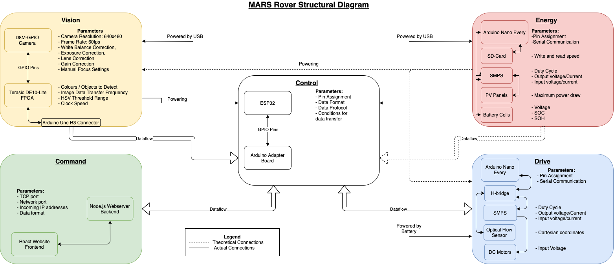

# Engineering Design Project MARS Rover

This repository contains the work done by *Georgios Chaimalas, Dimitrios Georgakopoulos, Edvard J. Skaarberg Holen, Hyunjoon Jeon, Josiah Mendes and Raghav Viswakumar* for module ELEC50003/ELEC50008 - Computer Engineering / Engineering Design Project 2 (Summer 2020-2021) as part of the second year curriculum in Electrical and Electronic Engineering or Electronic and Information Engineering at Imperial College London. 

## Project Description

The aim of the Mars Rover Project as outlined by our organisers is as 
follows: “To design and build an autonomous rover system that could be used in a remote location without direct supervision. The rover will have a processing unit that is capable to receive movement commands and send status data. In doing this it needs to detect and avoid obstacles in its working area. Over time the rover should be able to build a map of its local working area (including those obstacles) on an offsite data store. A charging station will be also designed and implemented to charge the batteries used to power up the rover."

To fulfil this broad goal, the design and development of the rover is separated into 
six distinct subsystems: **Command, Control, Drive, Energy, Integration and Vision**,
each of which will be led by a single team member. These modules will work semi-independently to 
achieve the functional requirements as defined by the problem and 
eventually integrate their findings and goals to achieve the goals set out by the specification 
at hand. We will work under the main consideration that our rover is meant 
to be a proof of concept for one that could function on Mars. This repository 
contains our design process for the rover, how it was implemented and challenges that were faced. 
The diagram belows shows a high level overview of the design, including the main hardware components and the connections between subsystems. 

A short demonstration of the Rover working is also shown in the following video. 

https://user-images.githubusercontent.com/43901878/122197381-0803a080-ce90-11eb-8abb-6028bb57da34.mp4

---

For more detailed information about how the Rover was designed and implemented, please refer to the [Full Report](https://github.com/JosiahMendes/Engineering-Design-Project-MARS-Rover/blob/master/Mars%20Rover%20Project%20Report.pdf). 
